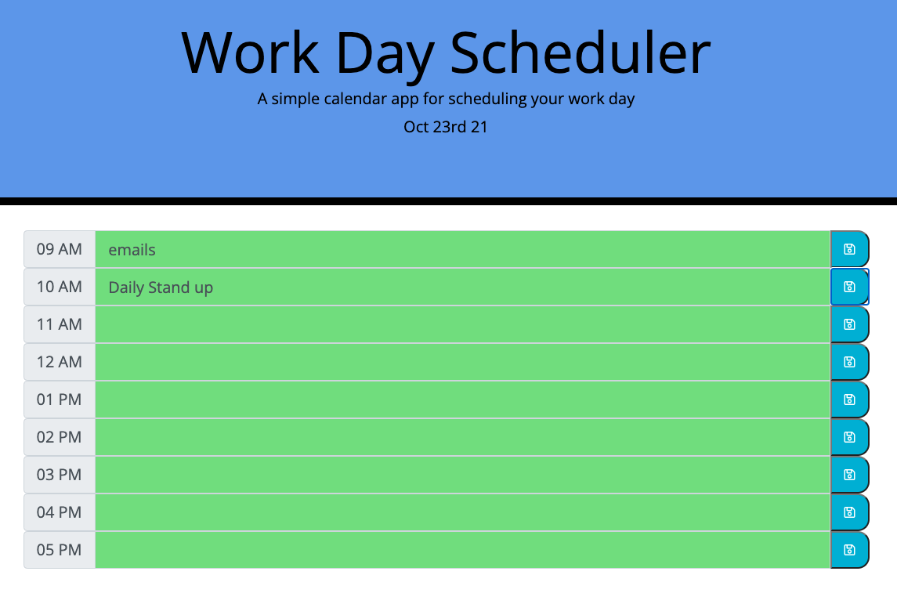

# Work Day Scheduler

#Description
This web application is a simple calendar that allows a user to save events for each hour of the day by modifying starter code. Employers with busy schedule can utilize this app to manage their daily routines and events.  
This app will runs on browser and feature dynamically updated HTML and CSS powered by jQuery.

#Technology utilized
HTML and CSS was utilized for the front end of the web page. JavaScript is used to implement logic behind coloring, saving and retriveing data, powered by JQuery it also allows to dynamically update HTML and CSS parts of the application and handle timing with Momentjs.

#Usage
Please open the website using following link: https://zahramammadli.github.io/Scheduler/.

Please choose the time block and input agenda/task.
Then click on Save Button on the right side of the page.
You can refresh the page, your tasks will remain.
Please note also coloring of the time blocks:

- Green - Future
- Grey - Passed
- Red - Current Hour.

You can find screenshot of the page in the assets/images folder, follow link below:

PageLink
GitLink: https://zahramammadli.github.io/Scheduler/
GitHub: https://github.com/ZahraMammadli/Scheduler/
